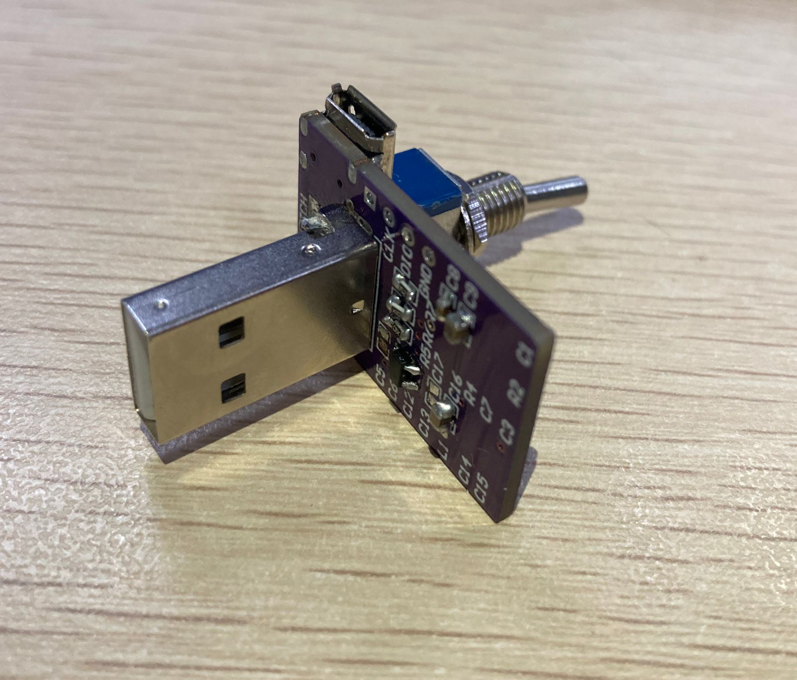
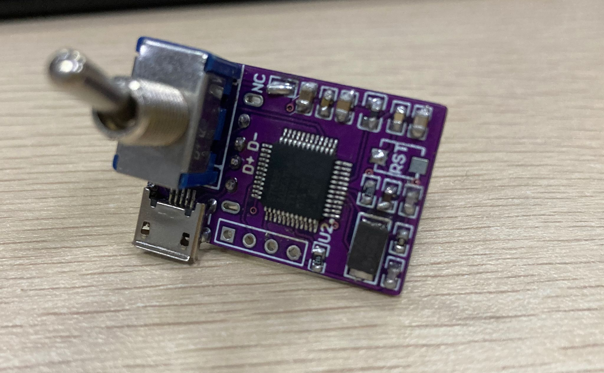
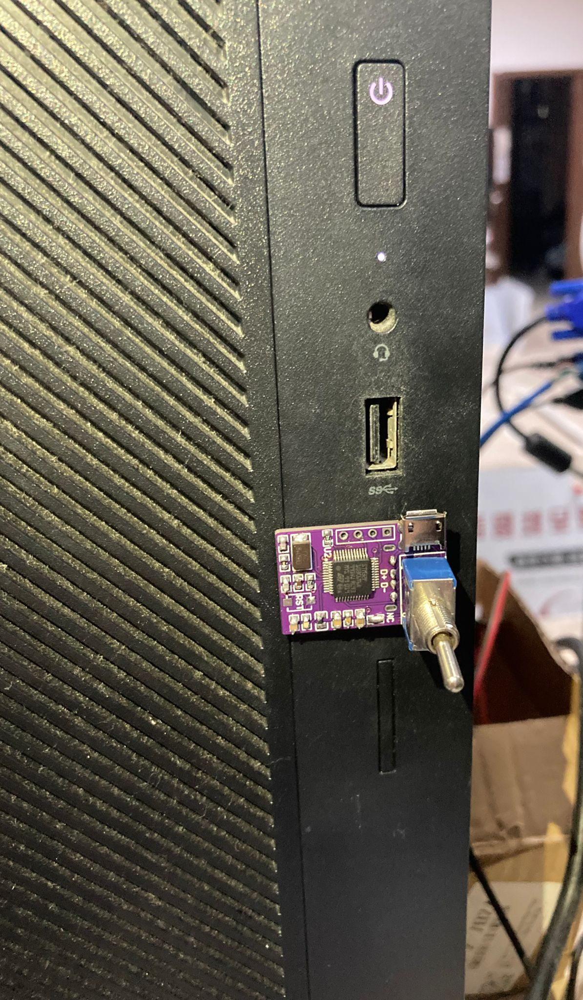
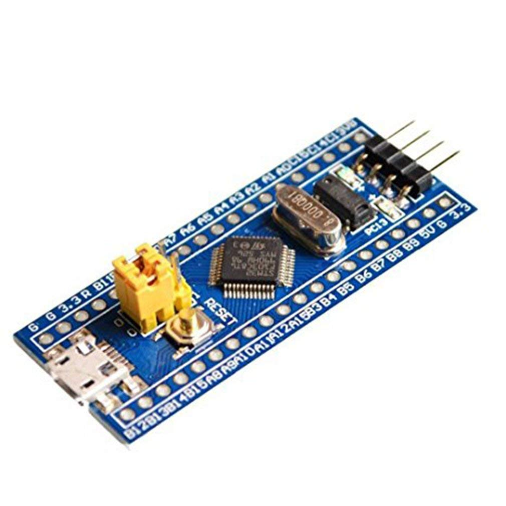
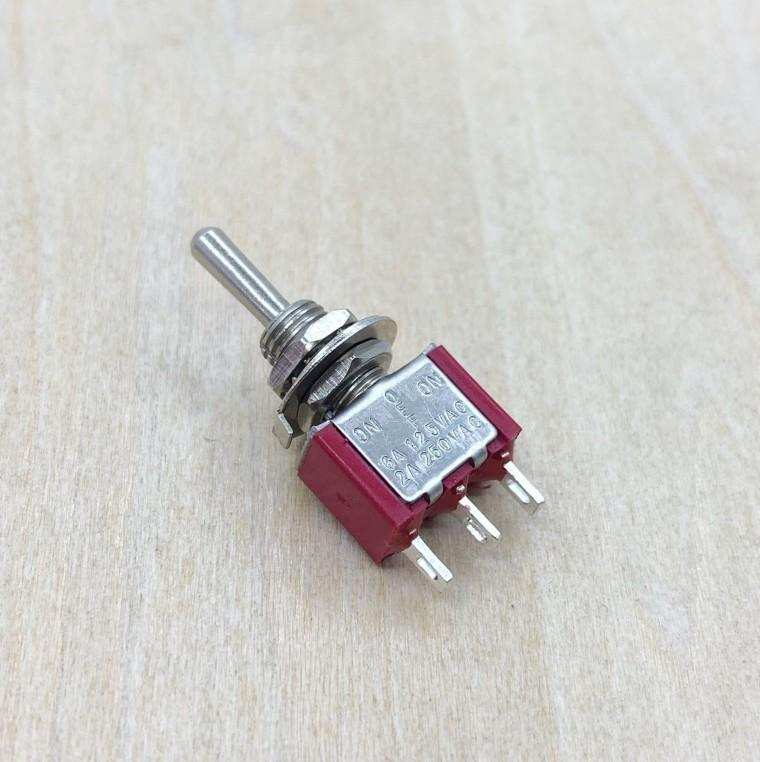
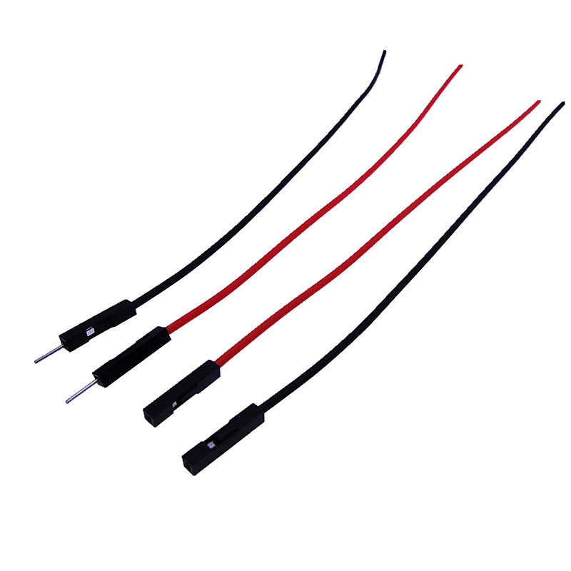
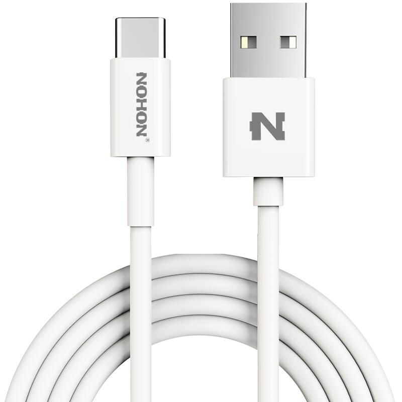
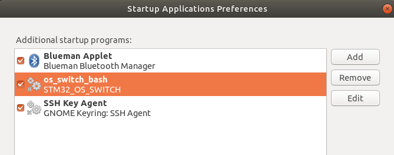
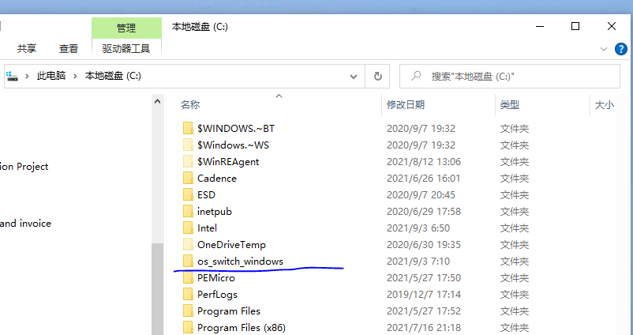
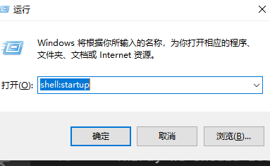

# Operating system switch
 This is a project that can help you automatically switch the operating system on your personal computer. With it, you can quickly switch between Windows and Linux during the use of the computer, without using the mouse and keyboard.

## Get a  hardware
- This project provides a switch model file, and the physical effect of the model is shown in the figure below，and the design files and bill of materials for the switch are placed in the hardware folder.
<figure class="Three">
    
</figure>


-  An easier way to obtain hardware is to buy a minimal system board online, connect it to a mechanical switch through a cable, and then connect the system board to the computer through a USB cable.

<figure class="four">
     
</figure>

## Building firmware with stm32f1xx


### Firmware of  'operating system switch'
Thanks for stecman, the firmware of hardware are refer from his work "hw-boot-selection".

- **(Required)**  On Linux, you'll need `gcc-arm-none-eabi` and `python` installed to build and `openocd` to flash. Such as this:
    ```
    sudo apt install gcc-arm-none-eabi
    sudo apt install openocd
    ```

- **(Optional)** You can update the library  named libopencm3, or just use the version in the directory. The details you can reference with stecman's project. And you only need to replace the 'src' directory.

- **(Required)** You can use follow command to build and flash the firmware,  before you do that, make sure you have a jlink or stlink to connect the device with your computer. 

### Building

```
cd Firmware\ for\ the\ Hardware/hw-os-selection
# Build the firmware with stm32f103c6t6
 make   
 # Flash with a J-Link programmer connected by SWD
make flash 
# Flash with an ST-Link programmer connected by SWD
make flash PROGRAMMER=stlink
```

### Attention

-  the default  mcu  is  `stm32f103c6t6`,  if you use other stm32f1xx chip,  such as `stm32f103c8t6` ,you can use :  `make DEVICE=stm32f103c8t6`
-  Until now,  the project only supported the series of stm32f1xx.
- The other series of chips are temporarily unable to provide support because the author does not have the relevant hardware, but you can try to replace them with F1 series chips from manufacturers such as `GD32` and `CK32`.


##  Build environment on PC

### On Linux
- First we need  to modify  system's GRUB configuration to look for and read from this device during boot.
```
    cd scripts
    sudo cp ./os_switch_linux/01_bootswitch /etc/grub.d/
    sudo chmod +x /etc/grub.d/01_bootswitch
    sudo update-grub

```
- Second we need to create a script to monitor the data changes of USB devices during system operation.
```
     cp ./os_switch_linux/os_switch_bash  ~
    
```


- Third, we should let the monitoring script start automatically when booting up.
```
In Ubuntu, you need find "Startup Applications Preference", and add the script to the application list.
In other system, 

```
   

### On Windows
- To run a python script, you need `python` `psutil` `StringIO`etc. 

- Copy the directory `os_switch_windows` to C disk root directory.

 

- Create a shortcut of `os_switch.vbs`
- Move the shortcut to the Startup directory
 
   - run `Windows+R ` and input `shell:startup` to the windows

   - copy the shortcut to the startup directory

    