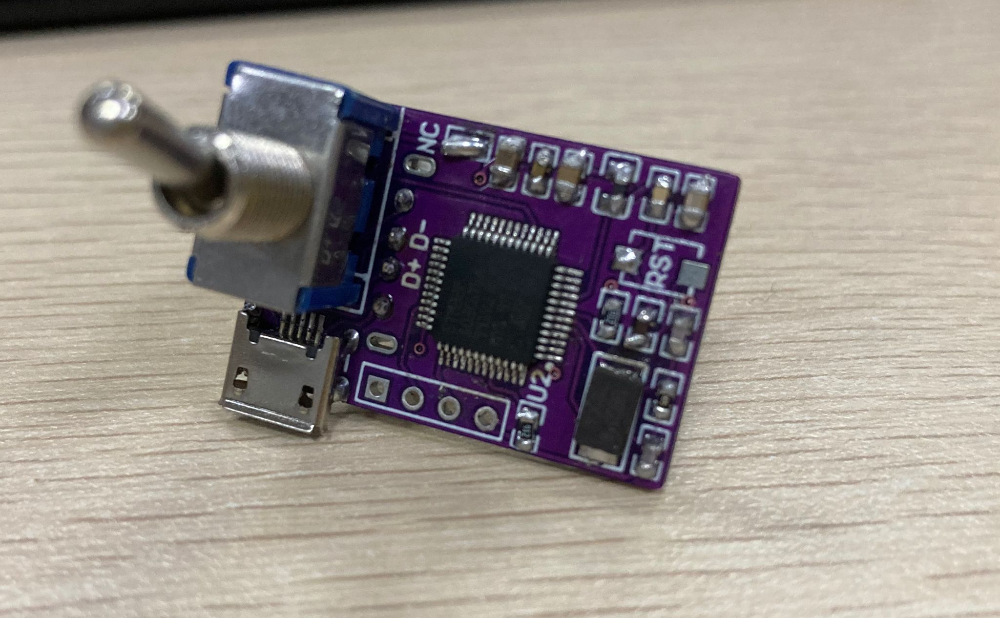
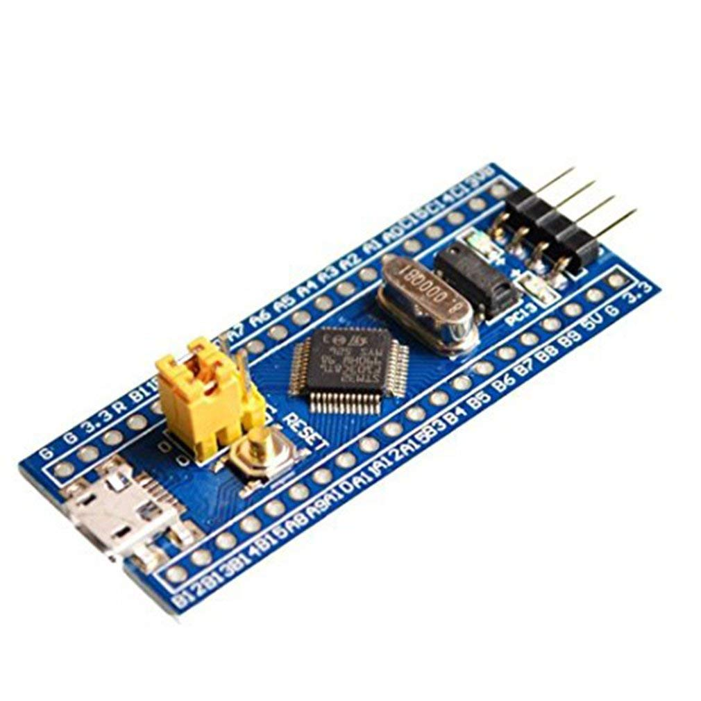
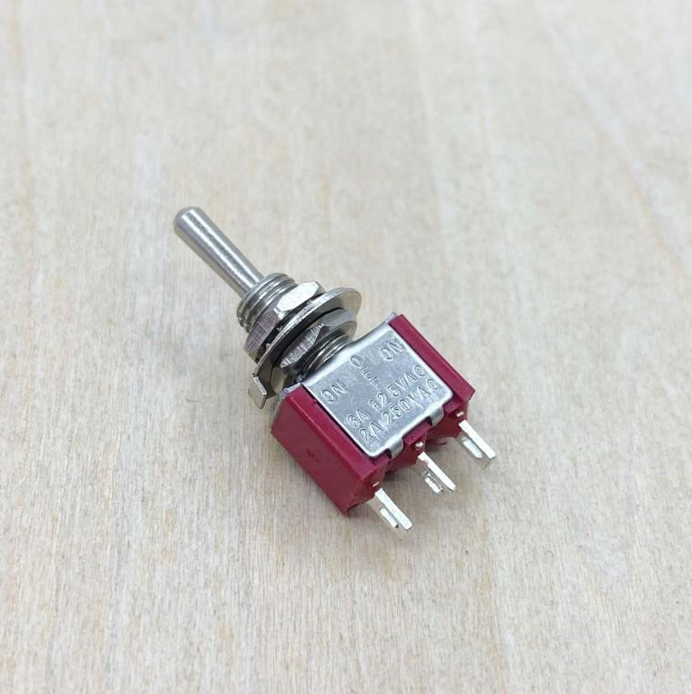
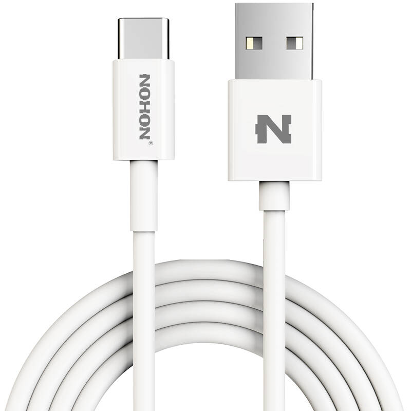
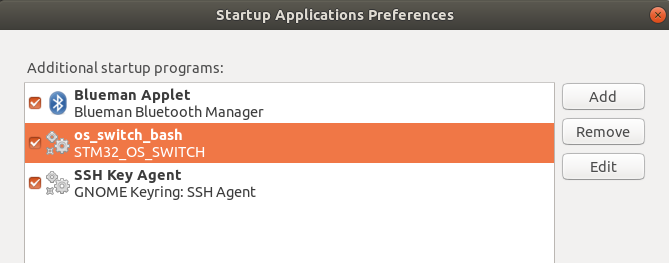

# 操作系统切换开关
。这是一个可以帮助你在个人电脑上自由切换操作系统的项目。该项目可以通过拨动开关（不使用鼠标键盘）快速切换Windows和Linux系统。支持关机状态下切换和系统运行时切换。 (。

## 硬件
- 项目里提供了一个简易模型的设计文件和BOM清单，有经验的朋友可以自行通过PCB打样然后焊接制作。实物图片如下所示（元器件可以根据实际情况删减）：
<figure class="Three">
    
</figure>


- 获得硬件的一种简单方法是在网上购买类似的STM32最小系统板，通过杜邦线或其他什么线MCU的PA6引脚连接到机械开关，然后通过 USB 线将系统板连接到计算机。

<figure class="four">
     
</figure>

## 固件下载

### Firmware of  'operating system switch'
感谢 stecman, 固件参考自他的github项目 "hw-boot-selection". 项目地址是 https://github.com/stecman/hw-boot-selection.git

- **(必须)** 在 Linux 上，您需要安装 `gcc-arm-none-eabi` 和 `python` 来编译，并需要安装 `openocd` 来下载程序。
    ```
    sudo apt install gcc-arm-none-eabi
    sudo apt install openocd
    ```

- **(可选)** 您可以更新 libopencm3 库，或者只使用目录中的版本。您可以参考 stecman 的项目的详细信息。只需要替换'src'目录。

- **(必须)** 您可以使用以下命令来构建和烧写固件，在此之前，请确保您有已经通过 jlink 或 stlink 将设备连接到了您的计算机。

### 编译下载

```
cd Firmware\ for\ the\ Hardware/hw-os-selection
# Build the firmware with stm32f103c6t6
 make   
 # Flash with a J-Link programmer connected by SWD
make flash 
# Flash with an ST-Link programmer connected by SWD
make flash PROGRAMMER=stlink
```

### 注意

- 默认mcu是`stm32f103c6t6`，如果你使用其他stm32f1xx芯片，比如`stm32f103c8t6`，你可以使用命令：`make DEVICE=stm32f103c8t6`
- 目前项目只支持stm32f1xx系列。
- 其他系列芯片暂时无法提供支持，因为笔者没有相关硬件，但可以尝试用`GD32`、`CK32`等厂商的F1系列芯片代替。


##  在电脑上构建环境

### On Linux
- 首先，我们需要修改系统的 GRUB 配置。
```
    cd scripts
    sudo cp ./os_switch_linux/01_bootswitch /etc/grub.d/
    sudo chmod +x /etc/grub.d/01_bootswitch
    sudo update-grub

```
- 其次我们需要创建一个脚本来监控系统运行过程中USB设备的数据变化。
```
     cp ./os_switch_linux/os_switch_bash  ~
    
```


- 监控脚本在开机时自动启动。
```
在Ubuntu上打开“启动应用程序”，添加自启动脚本

```
   

### On Windows
- 在windows上需要安装 `python` ，然后通过pip安装`psutil` `StringIO`等等，以确保python脚本能正常运行（可以先单独运行python脚本，看能否正常工作）. 

- 把文件夹 `os_switch_windows`复制到C盘根目录

 

- 为VB脚本 `os_switch.vbs`创建快捷方式
- 把快捷方式放到开机自启动文件夹
 
   -运行 `Windows+R ` ，在运行程序框中输入 `shell:startup` ，会打开一个文件夹，里面可以放置快捷方式，把之前创建的快捷方式放进去。


    